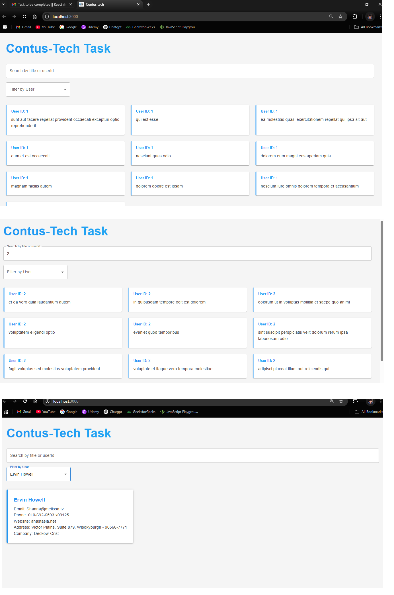

Please intall below libraries 
1. material Ui and bootstrap 
    npm install @mui/material @emotion/react @emotion/styled bootstrap
2. Axios and redux-thunk 
npm install redux react-redux redux-thunk axios

npm start 

